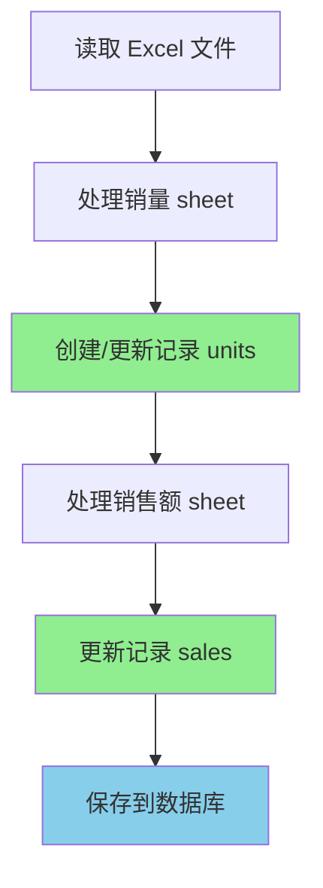

# 修复 units>0 但 sales=0 的问题

## 📋 问题描述

在 `bt_product_monthly_sales` 表中发现某些记录存在 `units > 0` 但 `sales = 0` 的异常情况。

## 🔍 问题分析

### 根本原因

在 `ParseProductSales` 函数中处理 Excel 文件时，存在两处逻辑问题：

#### 1. 处理销售额 sheet 的问题（第1014-1024行）

**原代码逻辑**：
```go
if colIdx >= len(row) || row[colIdx] == "" {
    continue  // 跳过空单元格
}

sales, err := strconv.ParseFloat(strings.TrimSpace(row[colIdx]), 64)
salesValid := err == nil && sales > 0  // 要求 sales 必须大于 0
```

**问题**：
- 空单元格被直接跳过，不处理
- 销售额为 0 的单元格被认为无效，不处理
- 但销量数据可能已经存在，导致创建了 `units > 0` 但 `sales = 0` 的记录

#### 2. 处理销量 sheet 的问题（第920-930行）

**原代码逻辑**：
```go
if colIdx >= len(row) || row[colIdx] == "" {
    continue  // 跳过空单元格
}

units, err := strconv.Atoi(strings.TrimSpace(row[colIdx]))
if err != nil || units <= 0 {
    continue  // 要求 units 必须大于 0
}
```

**问题**：
- 空单元格被直接跳过
- 销量为 0 的单元格被认为无效

### 数据流程分析

1. **先处理销量 sheet**：创建记录，`units = 100, sales = 0`
2. **再处理销售额 sheet**：
   - 如果该月销售额为空或 0，被跳过
   - 已存在的记录不会被更新
   - 最终结果：`units = 100, sales = 0` ❌

## ✅ 解决方案

### 修改 1：处理销售额 sheet

**修改位置**：`bt_import.go` 第 1014-1045 行

**修改后的代码**：
```go
date, err := time.Parse("2006-01", dateStr)
if err != nil {
    continue
}

// 获取单元格值，允许处理空单元格
var cellValue string
if colIdx < len(row) {
    cellValue = strings.TrimSpace(row[colIdx])
}

// 尝试解析销售额（允许0值和空值）
var sales float64
var salesValid bool
if cellValue != "" {
    var parseErr error
    sales, parseErr = strconv.ParseFloat(cellValue, 64)
    salesValid = parseErr == nil && sales >= 0  // 改为 >= 0，允许0值
} else {
    // 空单元格视为0
    sales = 0
    salesValid = true
}

// 查找是否已存在该月份的销售记录（可能从销量sheet创建）
found := false
for j, ms := range salesInfo.MonthlySales {
    if ms.Date.Year() == date.Year() && ms.Date.Month() == date.Month() {
        found = true
        // 更新sales字段（包括0值）
        if salesValid {
            salesInfo.MonthlySales[j].Sales = sales
        }
        break
    }
}

// 如果不存在记录，创建新记录（包括sales=0的情况）
if !found && salesValid {
    salesInfo.MonthlySales = append(salesInfo.MonthlySales, MonthlySales{
        Date:  date,
        Sales: sales,
        Units: 0,
    })
}
```

**关键改进**：
1. ✅ 不再跳过空单元格，将其视为 0
2. ✅ 允许销售额为 0（`sales >= 0`）
3. ✅ 即使销售额为 0，也会更新已存在的记录

### 修改 2：处理销量 sheet

**修改位置**：`bt_import.go` 第 920-950 行

**修改后的代码**：
```go
date, err := time.Parse("2006-01", dateStr)
if err != nil {
    continue
}

// 获取单元格值，允许处理空单元格
var cellValue string
if colIdx < len(row) {
    cellValue = strings.TrimSpace(row[colIdx])
}

// 尝试解析销量（允许0值和空值）
var units int
var unitsValid bool
if cellValue != "" {
    var parseErr error
    units, parseErr = strconv.Atoi(cellValue)
    unitsValid = parseErr == nil && units >= 0  // 改为 >= 0，允许0值
} else {
    // 空单元格视为0
    units = 0
    unitsValid = true
}

// 只有当销量有效时才处理
if unitsValid {
    // 查找或创建该月份的销售记录
    found := false
    for j, ms := range salesInfo.MonthlySales {
        if ms.Date.Year() == date.Year() && ms.Date.Month() == date.Month() {
            salesInfo.MonthlySales[j].Units = units
            found = true
            break
        }
    }
    if !found {
        salesInfo.MonthlySales = append(salesInfo.MonthlySales, MonthlySales{
            Date:  date,
            Sales: 0,
            Units: units,
        })
    }
}
```

**关键改进**：
1. ✅ 不再跳过空单元格，将其视为 0
2. ✅ 允许销量为 0（`units >= 0`）
3. ✅ 即使销量为 0，也会创建或更新记录

## 🎯 修复效果

### 修复前
| ASIN | Date | Units | Sales | 问题 |
|------|------|-------|-------|------|
| B09ZTYGGTJ | 2024-01 | 100 | 0 | ❌ 销售额丢失 |
| B08XYZABC | 2024-02 | 50 | 0 | ❌ 销售额丢失 |

### 修复后
| ASIN | Date | Units | Sales | 状态 |
|------|------|-------|-------|------|
| B09ZTYGGTJ | 2024-01 | 100 | 1234.56 | ✅ 正常 |
| B08XYZABC | 2024-02 | 50 | 0 | ✅ 正常（实际为0） |
| B07DEFGHI | 2024-03 | 0 | 0 | ✅ 正常（都为0） |

## 📝 验证步骤

1. **重启后端服务**
2. **通过 API 导入数据**：
   - 接口：`POST /btImport/batchImport`
   - 参数：
     - `marketId`: 1
     - `replaceMode`: true
     - `productSales`: 上传 `trekin-main/data/CNCRouter/product-US-sales.xlsx`
3. **验证数据**：
   ```sql
   -- 检查是否还有 units>0 但 sales=0 的异常数据
   SELECT COUNT(*) FROM bt_product_monthly_sales 
   WHERE units > 0 AND sales = 0;
   
   -- 查看具体数据
   SELECT asin, date, units, sales 
   FROM bt_product_monthly_sales 
   WHERE market_id = 1
   ORDER BY date DESC, asin
   LIMIT 20;
   ```

## 🔧 技术细节

### 数据处理流程



### 关键改进点

1. **空单元格处理**：
   - 修复前：跳过 → 数据丢失
   - 修复后：视为 0 → 数据完整

2. **零值处理**：
   - 修复前：`> 0` → 零值被忽略
   - 修复后：`>= 0` → 零值被保存

3. **数据更新逻辑**：
   - 修复前：只更新有效值（> 0）
   - 修复后：更新所有值（>= 0）

## 📊 影响范围

- ✅ 不影响现有正常数据
- ✅ 修复 units>0 但 sales=0 的异常数据
- ✅ 支持真实的零值数据（某月确实没有销售）
- ✅ 提高数据完整性和准确性

## 🚀 部署说明

1. 代码已修改完成
2. 需要重启后端服务
3. 重新导入数据进行验证
4. 建议清空旧数据后全量导入

---

**修复时间**：2025-11-01  
**修复文件**：`server/service/brandtrekin/bt_import.go`  
**修复行数**：约 60 行代码
